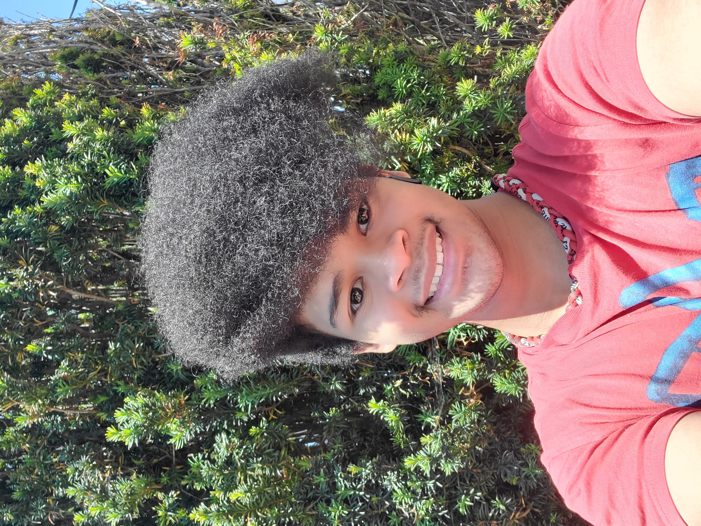

# Welcome to my Website!
# Introduction

Hello! My name is Von Taylor and I am pursuing a Bachelor of Science in Computer Science and I am looking to gain real-world experience in the technology field through internships! I have an interest in software development mobile application development, and full-stack development. I have experience in the Java, C, C++, Kotlin, Javascript, HTML, CSS, Python, and ARM programming languages, with Java being my current most comfortable language.

Nice to meet you!

# Other Personal Info
- [Github](https://github.com/Von-Taylor)
- [LinkedIn](https://www.linkedin.com/in/von-taylor3/)
- [Resume](https://github.com/Von-Taylor/VonTaylor/blob/main/Other-Resources/Von_Taylor_Resume.pdf)

# Academic Projects
### Software Tools and Techniques Lab Reports (CSE 15L)
- [Lab Report 1](https://von-taylor.github.io/cse15l-lab-reports/lab-report-week-1.html)
- [Lab Report 2](https://von-taylor.github.io/cse15l-lab-reports/lab-report-week-3.html)
- [Lab Report 3](https://von-taylor.github.io/cse15l-lab-reports/lab-report-week-5.html)
- [Lab Report 4](https://von-taylor.github.io/cse15l-lab-reports/lab-report-week-7.html)
- [Lab Report 5](https://von-taylor.github.io/cse15l-lab-reports/lab-report-week-9.html)

### Fundamentals/Engineering Application (ENG 10)
- [StudyBox](https://github.com/Von-Taylor/StudyBox)

### Intro to Programming - Java (CIS 284)
- [Memory Matching Game](https://github.com/Von-Taylor/Memory-Matching-Game)

### Teaching Computation in the Digital World Portfolio (EDS 124BR)
- [Portfolio](https://von-taylor.github.io/Portfolio/)

### Peer Intructor Tutoring Slides
- [Outreach Slides](https://docs.google.com/presentation/d/1IusKmt25851N3LJ9k8SiUwIpQWVht0TRYmyf_BpR034/edit?usp=sharing)
- [Physics Workshop Slide Set 1](https://docs.google.com/presentation/d/119aLb5Oa-UguGx-zsz6Wc6-K9FBB5MQ0CAZ86c-gnLw/edit?usp=sharing)
- [Physics Workshop Slide Set 2](https://docs.google.com/presentation/d/1ELYulQB-N2l5JLZol76tm1K6Gn8qdD1br1kA6XNx9iQ/edit?usp=sharing)
- [Physics Workshop Slide Set 3](https://docs.google.com/presentation/d/1tY2KhB3fndSf9glP2MHZom9-_d6KTFfn_ZqMFIoxkM0/edit?usp=sharing)

### Computer Organization and Systems Programming (CSE 30)
- (Can't show yet due to Academic Integrity)
- (Please contact me to request access)

### Advanced Data Structures (CSE 100)
- (Can't show yet due to Academic Integrity)
- (Please contact me to request access)

# Side Projects
### Android Studio
- [Password Generator Mobile App (Android Studio)](https://github.com/Von-Taylor/Password-Generator)
- [Show Decider Mobile App (Android Studio)](https://github.com/Von-Taylor/Show-Decider)
- [Calculator Mobile App (Android Studio)](https://github.com/Von-Taylor/My-Calculator)

### Pacific Bay High School Alumni Magazine Non-Profit Organization
- [Pacbay Alumni Magazine Vol 2 No 3 Publication](https://www.flipsnack.com/pacbayalumni/vol-2-no-3-pacbay-alumni-magazine.html)
- [Pacbay Alumni Magazine Vol 2 No 2 Publication](https://www.flipsnack.com/pacbayalumni/vol-2-no-2-pacbay-alumni-magazine-1.html)
- [Pacbay Alumni Magazine Vol 2 No 1 Publication](https://www.flipsnack.com/pacbayalumni/pacbay-alumni-magazine-vol-2-no-1.html)
